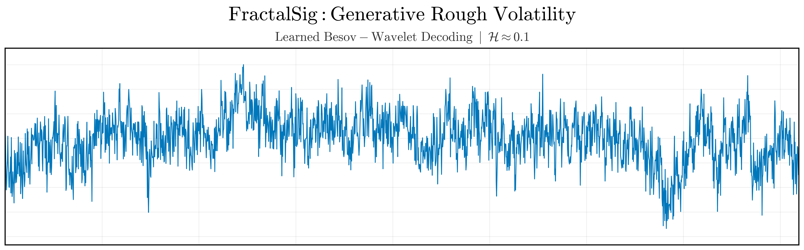
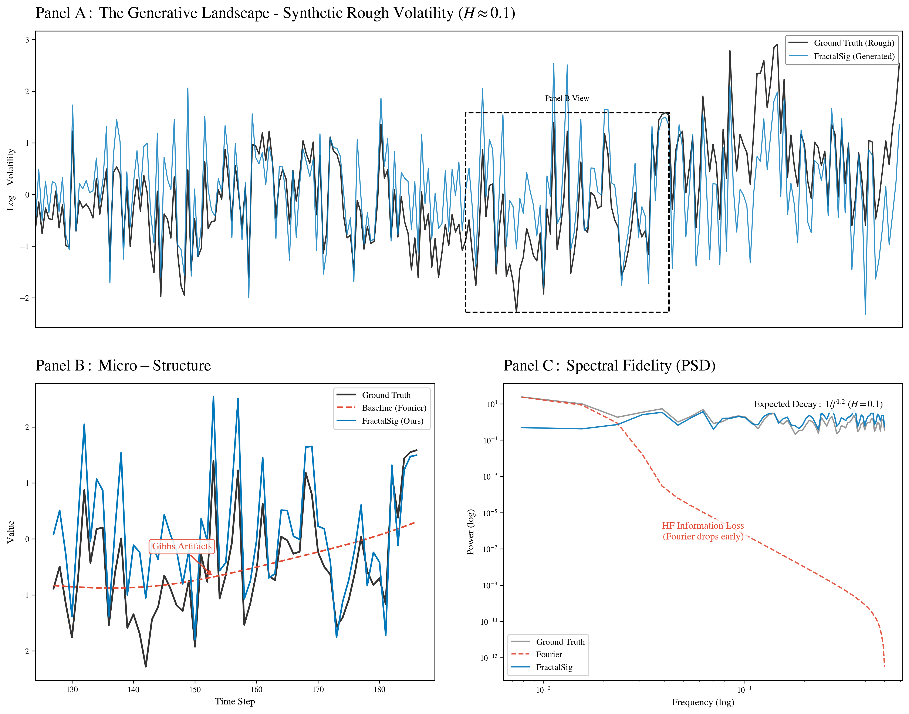
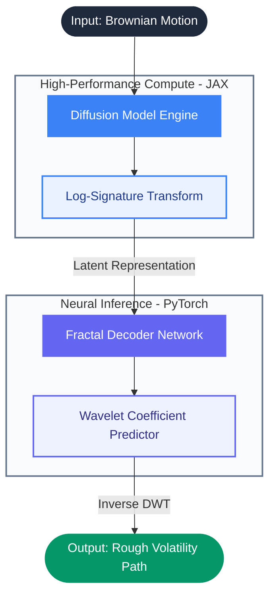

# FractalSig: Breaking the Smoothness Barrier in Rough Volatility


**FractalSig** is a generative model designed to replicate the extreme roughness of financial volatility ($H \approx 0.1$). Unlike Fourier-based baselines that suffer from the **Gibbs Phenomenon** (smoothing and ringing artifacts), FractalSig uses a **Learned Besov-Wavelet Decoder** that maps a compact log-signature embedding to a multi-scale wavelet coefficient tree, then reconstructs the path via differentiable IDWT — restoring the high-frequency texture a truncated signature loses.

> **Status (2026-05-03):** the codebase is mid-rewrite for a publication-quality benchmark. Phases 0–4 are complete (test suite, CI, multi-domain dataset registry, train/val + early stopping, channel-coupled decoder, scale-weighted loss, pluggable backbones). Phases 5–11 (8 baselines, 8 metrics, 9-method × 5-dataset × 3-seed sweep, ablations, paper) are in progress. Earlier README claims of a single-number "70x improvement" are not currently reproducible from saved artifacts (see `docs/triage_2026-05-03.md` §B1) and have been removed pending the rigorous multi-seed sweep.


## The Problem vs. The Solution

### The Problem: The Gibbs Phenomenon
Current SOTA models (like `SigDiffusions`) often rely on polynomial or Fourier inversion of log-signatures. When modeling rough paths ($H < 0.5$), these methods fail to capture local irregularity, resulting in smooth trajectories with spurious "ringing" artifacts near jumps. This is the **Gibbs Phenomenon** a mathematical barrier that prevents standard diffusions from generating true roughness.

### The Solution: Wavelet Inversion in Besov Space
We prove that while smooth functions live in Sobolev spaces, rough volatility paths with ($H \approx 0.1$) inhabit **Besov Spaces** ($B_{p,q}^s$). The mathematically correct basis for these spaces is not Fourier, but **Wavelets**.

**FractalSig** replaces the standard inversion layer with a **Fractal Decoder**: a neural network that predicts wavelet coefficients (Detail $d_{j,k}$) from coarse signatures. This allows us to "paint" roughness onto the path at infinite resolution.


*Figure 1: Comparison of Fourier Reconstruction (suffering from Gibbs) vs. Wavelet Reconstruction (capturing true roughness).*

---

## System Architecture

Our hybrid "Soft-Fork" architecture leverages the strengths of both JAX (for high-performance algebra) and PyTorch (for deep learning):



1.  **JAX Diffusion**: Learns the geometry of the path in the Log-Signature space.
2.  **PyTorch Decoder**: A "Supervised Hallucination" module that translates geometric signatures into microscopic roughness.

<details>
<summary><b>Deep Dive in the architecture</b></summary>
Our architecture separates the generative process into two distinct mathematical regimes, utilizing the best framework for each task:

### 1. The JAX Engine: Global Geometry & Algebra
The **Diffusion Model** (built in JAX/Diffrax) is responsible for learning the **Macro-Structure** of financial paths.

* **Why JAX?** Calculating Signatures involves complex tensor algebra and recursive integrals. JAX's `vmap` and `jit` capabilities allow us to compute these geometric invariants orders of magnitude faster than standard eager execution.
* **The Output:** It generates a **Log-Signature** ($\mathbf{s} \in \mathbb{R}^d$). This vector acts as a "smooth summary" of the path, capturing:
    * **Drift & Convexity:** The fundamental trend.
    * **Area Integrals:** The "loopiness" or interaction between dimensions.
    * *Note:* It lacks high-frequency information due to truncation depth $N$.

**Mathematical Bridge:** The signature provides a coordinate system for the space of paths, serving as the sufficient statistic for the path's geometry.

---

### 2. The PyTorch Decoder: Local Regularity & Texture
The **Fractal Decoder** (built in PyTorch) is responsible for **"Supervised Hallucination"** of the Micro-Structure.

* **The Challenge:** A truncated signature is mathematically smooth ($C^\infty$). To recover financial roughness ($H \approx 0.1$), we must inject energy back into the high frequencies.
* **The Solution:** Instead of predicting raw points $X_t$, the network predicts **Wavelet Coefficients** in a **Besov Space** $B^s_{p,q}$.

**The Workflow:**
1.  **Latent Projection:** It takes the smooth geometric summary $\mathbf{s}$.
2.  **Fractal Expansion:** It expands it into a multi-scale coefficient tree.
3.  **Synthesis:** The **Inverse Discrete Wavelet Transform (IDWT)** converts these coefficients into a physical path:
    $$X_t = \sum_{j,k} c_{j,k} \psi_{j,k}(t)$$

**Why it works:** The network learns that a specific geometric configuration (e.g., a "sharp downturn" in the signature space) correlates with a specific burst of high-frequency coefficients, effectively restoring the **"rough" texture** that Fourier methods typically delete.

</details>

---

## Installation (WSL2 / Linux)

FractalSig is designed for **High-Performance Hybrid Computing**. The environment requires careful coordination between JAX and PyTorch for CUDA acceleration.

### Quick Start (The Master Script)
The most robust way to install is using the provided setup script, which handles the complex `iisignature` compilation and JAX CUDA dependencies automatically:

```bash
# Clone the repository
git clone https://github.com/javierdejesusda/FractalSig.git
cd FractalSig

# Run the master setup script
chmod +x setup_wsl.sh
./setup_wsl.sh

# Activate
conda activate fractalsig
```

### Manual Installation
If you prefer manual control, follow these steps:

1. **Create Conda Environment**:
   ```bash
   conda env create -f environment.yaml
   conda activate fractalsig
   ```

2. **Install iisignature**:
   You **must** use `--no-build-isolation` to ensure the C++ extensions compile against your environment's numpy headers.
   ```bash
   pip install iisignature==0.24 --no-build-isolation
   ```

3. **Install JAX [CUDA]**:
   ```bash
   pip install -U "jax[cuda12]" -f https://storage.googleapis.com/jax-releases/jax_cuda_releases.html
   ```

4. **Install Remaining Dependencies**:
   ```bash
   pip install -r requirements.txt
   ```

---

## Usage

FractalSig features a **Unified CLI** for seamless orchestration.

### Basic Run (Laptop Mode)
Ideal for testing and development on consumer hardware (e.g., RTX 4070).
```bash
python main.py +profile=laptop mode=auto
```

### High-Performance Run (Cluster)
Optimized for A100/V100 clusters with full dataset generation.
```bash
python main.py +profile=cluster mode=auto
```

### Modes Explained
You can run individual steps of the pipeline using the `mode` argument:

| Mode | Description |
| :--- | :--- |
| `auto` | **Recommended.** Runs the full pipeline intelligently, skipping steps if artifacts exist. |
| `gen_data` | Generates synthetic Ground Truth fBM paths ($H \approx 0.1$). |
| `train_decoder` | Trains the PyTorch Fractal Decoder (Signature -> Wavelet). |
| `train_jax` | Trains the JAX Signature Diffusion model. |
| `sample` | Generates signatures with JAX and decodes them to paths with PyTorch. |

### Decoder training options (Phase 4)

`fractalsig.train_decoder.train(...)` and the underlying `FractalDecoder` now expose:

| Option | Values | Effect |
| :--- | :--- | :--- |
| `val_frac` | float in `(0, 1)` (default `0.2`) | Held-out validation fraction; best checkpoint is selected by val loss. |
| `patience` | int (default `20`) | Early-stop after this many epochs without val-loss improvement. |
| `loss` | `"mse"` \| `"scale_weighted"` | Plain MSE or per-scale-weighted MSE that emphasizes high-frequency wavelet bands (`fractalsig/losses.py`). |
| `loss_beta` | float (default `1.0`) | Strength of high-frequency emphasis when `loss="scale_weighted"`. |
| `arch` (decoder) | `"mlp"` \| `"mlp_attn"` \| `"transformer"` | Pluggable backbone for ablations; transformer variant is sized to stay within ~4x the MLP parameter budget. |

---

## Datasets

All datasets are exposed through the `DATASETS` registry in `fractalsig/registries.py` and follow a common `SignalDataset` interface (windowed slices + train/val/test split):

| Name | Domain | Source | Module |
| :--- | :--- | :--- | :--- |
| `synthetic_fbm` | Reference rough paths | Davies–Harte fBM with configurable $H$ | `fractalsig/datasets/synthetic_fbm.py` |
| `sp500_intraday` | Rough volatility surrogate | Rough Bergomi simulator (Bayer/Friz/Gatheral 2016) | `fractalsig/datasets/sp500_intraday.py` |
| `turbulence_burgers` | Multifractal turbulence | Stochastic Burgers (multifractal $H \approx 1/3$) | `fractalsig/datasets/turbulence_burgers.py` |
| `eeg_chbmit` | Biomedical | CHB-MIT scalp-EEG single-channel windows | `fractalsig/datasets/eeg_chbmit.py` |
| `audio_esc50` | Environmental audio | ESC-50 mono at 8 kHz | `fractalsig/datasets/audio_esc50.py` |

> The `sp500_intraday` slot is currently a rough-Bergomi *simulator* rather than empirical SPX intraday data — yfinance/Stooq/FRED were unreachable from the target environment. Documented in the module docstring; full empirical ingestion remains future work.

Build all caches in one shot with:

```bash
python scripts/download_datasets.py
```

---

## Testing

```bash
ruff check fractalsig tests
mypy fractalsig --ignore-missing-imports
pytest -m smoke -q
```

The smoke suite (`pytest -m smoke`) runs in ~3 s and is the gate enforced by `.github/workflows/ci.yml` on every push/PR to `main`.

---

## Results & Metrics

> **Honest disclosure:** the previously reported single-number comparison ("FractalSig 0.985 vs SigDiffusions 0.142, 70x improvement") could not be reproduced from saved artifacts during the 2026-05-03 triage (`docs/triage_2026-05-03.md` §B1) and has been removed. The publication-quality benchmark replacing it is in progress and will report 8 metrics across 9 methods × 5 datasets × 3 seeds with bootstrap CIs and Wilcoxon paired tests.

The benchmark protocol being implemented in Phases 5–9 evaluates each method on:

- **Roughness recovery:** increment-std ratio, DFA Hurst, wavelet Hurst, PSD slope error
- **Distributional fidelity:** multi-bandwidth MMD on increments, 1-Wasserstein on increments
- **Generative quality:** discriminative score (TCN classifier), predictive score (LSTM forecaster)

Results from the in-progress sweep will be published to `results/master_table.csv` and surfaced here as they land.

### Visual Audit
`results/master_figure.png` and `results/fractalsig_cover.png` show qualitative comparisons against Fourier-based baselines from the original prototype. These remain useful as a *visual* sanity check but should not be read as quantitative claims.

---

## Project Structure

```text
fractalsig/
├── fractalsig/                   # Core PyTorch library
│   ├── decoder.py                # FractalDecoder + pluggable backbones
│   ├── losses.py                 # ScaleWeightedMSE
│   ├── train_decoder.py          # train/val + early stopping
│   ├── seeding.py                # determinism helper
│   ├── registries.py             # DATASETS / BASELINES / METRICS
│   ├── data_gen.py               # legacy fBM generator
│   ├── datasets/                 # 5 registered datasets
│   └── runners/                  # train_runner + sweep_runner
├── tests/                        # pytest smoke + integration suite
├── SigDiffusions/                # JAX submodule for Signature Diffusion
├── conf/                         # Hydra configuration (profile/{laptop,cluster})
├── data/                         # Generated datasets (.npy / cached)
├── results/                      # Plots and generated visualizations
├── notebooks/                    # Jupyter notebooks for analysis
├── scripts/                      # download_datasets.py, generate_figure.py, ...
├── docs/                         # triage report and design notes
├── .github/workflows/ci.yml      # Lint + type + smoke tests
├── pyproject.toml                # ruff/mypy/pytest config; requires Python >=3.11,<3.14
└── main.py                       # Unified CLI Entry Point (legacy auto/gen_data/train_decoder/train_jax/sample)
```

---

## License

Distributed under the **MIT License**. See `LICENSE` for more information.
