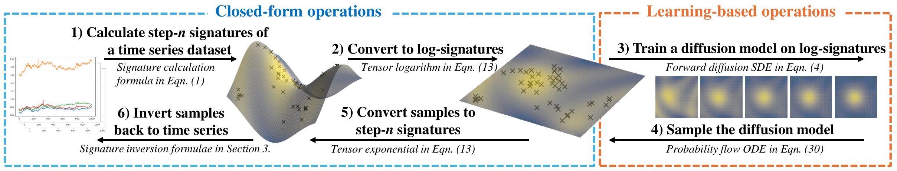

# SigDiffusions: Score-Based Diffusion Models for Time Series via Log-Signature Embeddings

This repository contains code for the paper [SigDiffusions: Score-Based Diffusion Models for Time Series via Log-Signature Embeddings](https://openreview.net/forum?id=Y8KK9kjgIK).

**Overview diagram of the SigDiffusions pipeline for generating multivariate time series:**



The signatures of a time series dataset are points distributed in a non-Euclidean space (Lie group). Converting to log-signatures maps them to a Euclidean space (Lie algebra) where standard diffusion models operate. Calculating the log-signature embedding and its inverse (blue box) are fully deterministic operations, which greatly simplifies the learning task. The log-signatures serve as inputs to a score-based diffusion model (orange box). Step 6 is enabled by our newly derived closed-form inversion formulae.

## Set Up Instructions

1. **Set Up Environment**:

   ```sh
   conda create -n sigdiffusions python=3.13
   conda activate sigdiffusions
   pip install numpy
   pip install -r requirements.txt
   ```

2. **Create an Empty Data Folder**: Create a folder named `data` in the root directory.

   ```sh
   mkdir data
   ```

3. **Download Data**: Download the required data from [this Google Drive link](https://drive.google.com/drive/folders/1VczlFKk5ckU5YNqNi9q9wbJBnKMuxiu6) and place it into the `data` folder.

## Running SigDiffusions

To generate synthetic time series, the SigDiffusions pipeline consists of the following intermediate steps, which can be run separately:

1. **Compute Signatures**: Compute the log-signatures of the underlying time series with additional preprocessing and augmentation steps that will later allow us to invert them. The time series dataset will be stored in `./data/real_paths/` and the dataset of corresponding log-signatures will be in `./data/real_sigs/`.

   ```sh
   python main.py compute-sigs <dataset_name> config/<dataset_config>.yaml
   ```

2. **Train Diffusion Model to Generate Log-Signatures**: The model will be stored in `.model_checkpoints/`.

   ```sh
   python main.py train <dataset_name> config/<dataset_config>.yaml
   ```

3. **Sample Diffusion Model**: Sample the trained model to generate synthetic log-signatures which will be stored in `./data/generated_sigs/`.

   ```sh
   python main.py sample <dataset_name> config/<dataset_config>.yaml
   ```

4. **Invert Signatures**: Invert the generated log-signatures via Fourier inversion to obtain the corresponding time series which will be stored in `./data/generated_paths/`.

   ```sh
   python main.py invert-sigs <dataset_name> config/<dataset_config>.yaml
   ```

### Run Everything (recommended)

**Note**: If you would like to run the full pipeline, you can do so via `run-all`:

```sh
python main.py run-all <dataset_name> config/<dataset_config>.yaml
```

## Example Commands for Datasets

For running on each of our datasets, use the following commands:

```sh
# Sines
python main.py run-all sines config/sines.yaml

# Predator-Prey
python main.py run-all predator_prey config/predator_prey.yaml

# HEPC
python main.py run-all hepc config/hepc.yaml

# Exchange Rates
python main.py run-all exchange_rates config/exchange_rates.yaml

# Weather
python main.py run-all weather config/weather.yaml
```

## Evaluation

Run the `./evaluation/evaluation.ipynb` notebook to get the evaluation metrics.

## Guide to Config

Here is a guide to setting specific fields in the `./config/<dataset_name>.yaml` file if one wants to add a new dataset:

- `data_path`: Path to the dataset file.
- `preprocessing_fn`: Function to preprocess the data into a numpy array of shape (samples x time series length x channels).
- `seq_len`: Time series length.
- `dim`: Number of channels.
- `scaler`: Feature scaler. Options: `minmax` (0 to 1), `None`. For new datasets, start with `minmax`.
- `shuffle`: Whether to shuffle the data. Make sure this is `True` if not already shuffled.
- `sig_depth`: Signature truncation depth. For new datasets, start with 4. Reasonable values are in the range 2 to 6. Paths with high-frequency components will require higher truncation levels to fully capture the shape.
- `by_channel`: Whether to compute signatures by channel. `True` is the recommended option. If `False`, linear attention will be used instead of full attention.
- `mirror_augmentation`: Whether to use the mirror augmentation. Start with `False`.
- `test_set_size`: Number of time series that will be held out during training. We use this set as real data for computing metrics in `evaluation.ipynb`.

Keep the model, training, and sampling configuration as proposed, or adjust according to standard practices.

## Citation

If you find this repo useful, please cite our paper via

```bibtex
@inproceedings{barancikova2025sigdiffusions,
   title={SigDiffusions: Score-Based Diffusion Models for Time Series via Log-Signature Embeddings},
   author={Barbora Barancikova and Zhuoyue Huang and Cristopher Salvi},
   booktitle={The Thirteenth International Conference on Learning Representations},
   year={2025},
   url={https://openreview.net/forum?id=Y8KK9kjgIK}
}
```

## Acknowledgements

We appreciate the following GitHub repositories for their valuable code base:

https://github.com/Y-debug-sys/Diffusion-TS

https://github.com/jsyoon0823/TimeGAN

https://github.com/issaz/sigker-nsdes

https://github.com/patrick-kidger/equinox

https://github.com/yang-song/score_sde

https://github.com/morganstanley/MSML/tree/main/papers/Stochastic_Process_Diffusion
